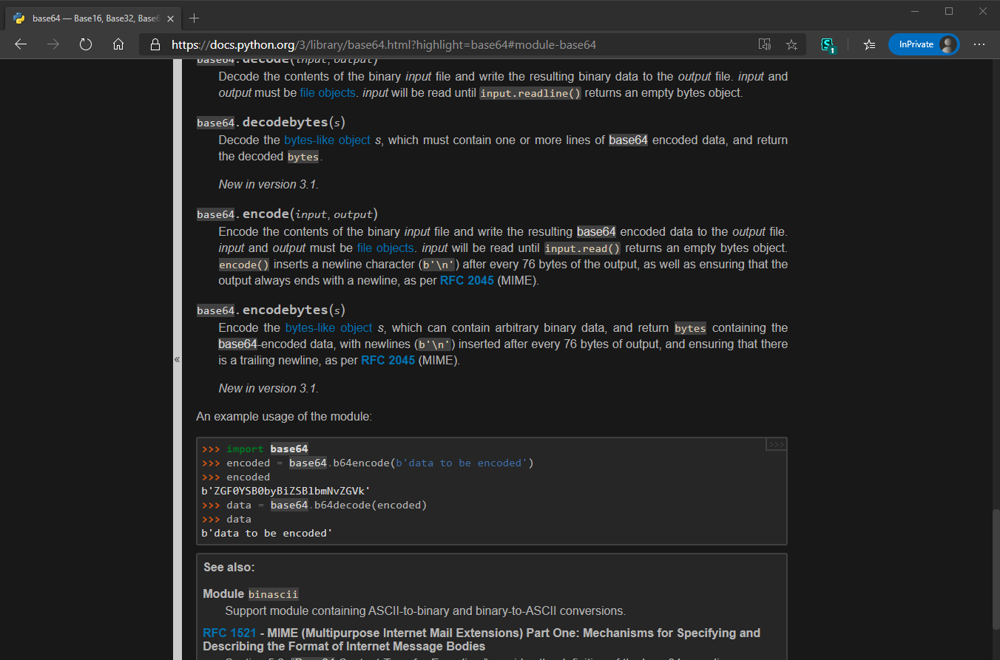

<h1 align="center">
    <b>Python Docs</b> 
    Dark Theme
</h1>
<h2 align="center">
    📦 <a href="https://github.com/maximilionus/python_docs_dark/raw/master/python_docs_dark.user.css">INSTALL</a>
</h2>
  

    
Preview Image

    

