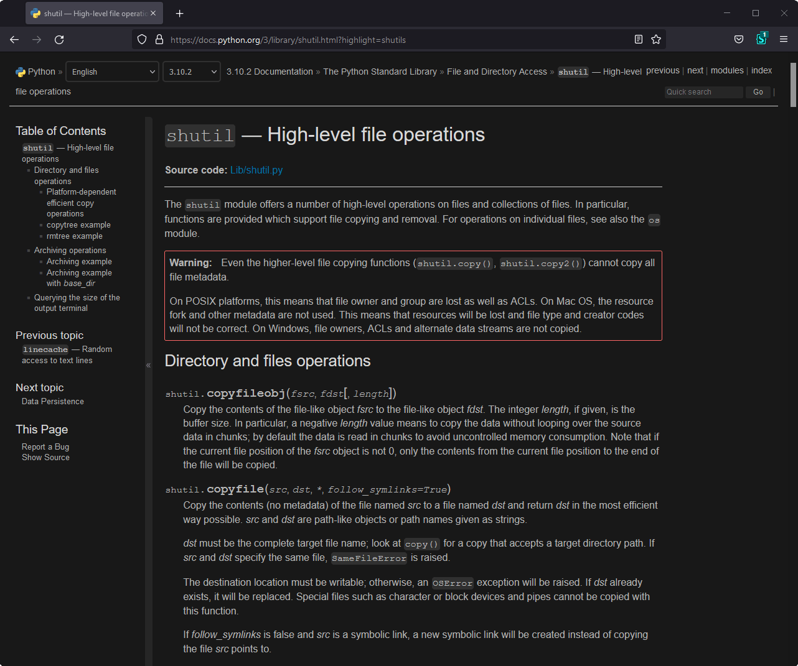

<h1 align="center">
    Python Docs 
    Dark Theme
</h1>

Preview Image

    

## About
This repository contains the userstyle dark theme for python documentation and other web pages that inherit the stylesheet from official docs.

## Installation
1. Ensure that **Stylus** extension ([Chrome](https://chrome.google.com/webstore/detail/stylus/clngdbkpkpeebahjckkjfobafhncgmne), [Firefox](https://addons.mozilla.org/ru/firefox/addon/styl-us/)) is installed in your browser
2. 📦 [Install the usercss](https://github.com/maximilionus/python_docs_dark/raw/master/python_docs_dark.user.css)

## Supported Domains
Here's list of domains that are currenlty supported by this userstyle.

- docs.python.org
- packaging.python.org

> If you know of other domains that inherited the style from docs.python.org, you can notify me by [creating the new issue](https://github.com/maximilionus/python_docs_dark/issues/new?labels=add%20to%20supported%20pages)
