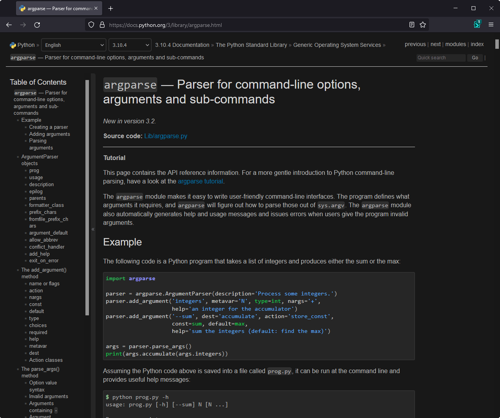

<h1 align="center">
    Python Documentation 
    Dark 🌒 Theme
</h1>

|          Preview          |          Adaptive Mode           |
| :-----------------------: | :------------------------------: |
|  |  |

## ❓ About
This repository contains the userstyle dark theme for python documentation and other web pages that inherit the stylesheet from official docs.

## 📦 Installation
1. 🧩 Ensure that **Stylus** extension ([Chrome](https://chrome.google.com/webstore/detail/stylus/clngdbkpkpeebahjckkjfobafhncgmne), [Firefox](https://addons.mozilla.org/ru/firefox/addon/styl-us/)) is installed in your browser
2. ✔️ Select one of the theme variants below:
   - [⬇️ Adaptive][gh-raw-adaptive]
   - [⬇️ Default][gh-raw-default]

   > **Adaptive** theme activation depends on selected web browser color scheme, while **Default** one will always be active

## 🆙 Updating
This userstyle is configured to install all updates right from this repository's `master` branch with Stylus updater, located on the *Installed Styles* page of this extension

## ☄️ Supported Domains
Here's list of domains that are currently supported by this userstyle.

- docs.python.org
- packaging.python.org

> If you know of other domains that inherited the style from docs.python.org, you can notify me by [creating the new issue](https://github.com/maximilionus/python_docs_dark/issues/new?labels=add%20to%20supported%20pages)

<!-- REFERENCE LINKS -->
[gh-raw-adaptive]: https://github.com/maximilionus/python_docs_dark/raw/master/python_docs_dark_adaptive.user.css (Raw adaptive theme)
[gh-raw-default]: https://github.com/maximilionus/python_docs_dark/raw/master/python_docs_dark.user.css (Raw default theme)
